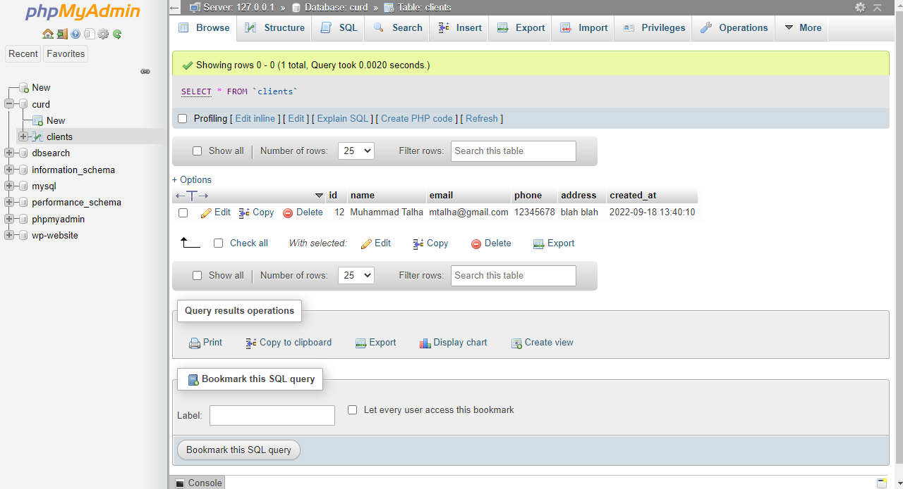
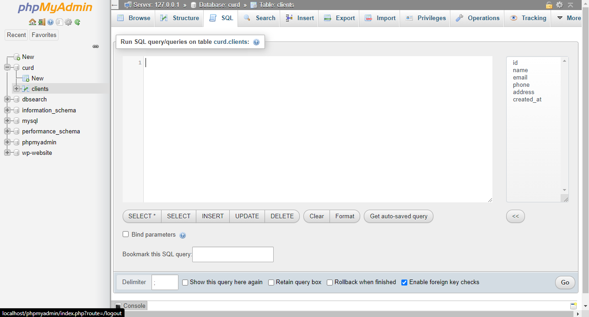
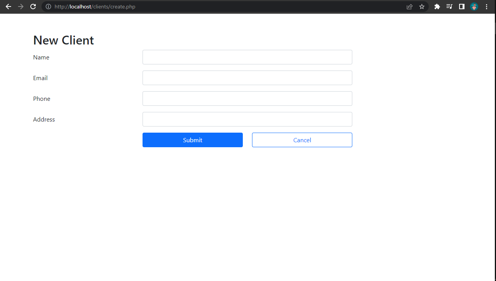
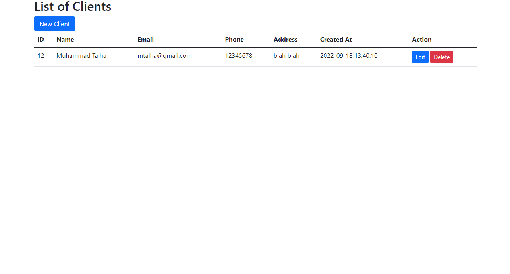
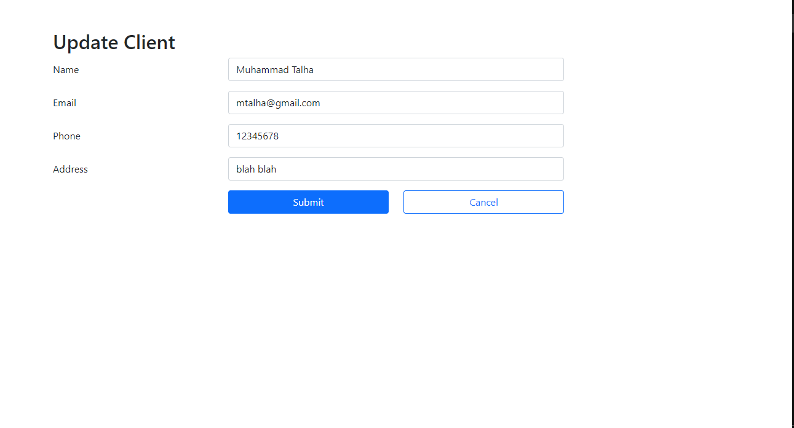

<h1>PHP and MySQL with CRUD Operations: Create, Read, Update, Delete</h1>
First of All Create a Database named <strong>curd</strong>
  
1-

Paste the following Command in SQL section. It will Create a database table. 

CREATE TABLE clients (
    id INT NOT NULL PRIMARY KEY AUTO_INCREMENT,
    name VARCHAR (100) NOT NULL,
    email VARCHAR (200) NOT NULL UNIQUE,
    phone VARCHAR(20) NULL,
    address VARCHAR(200) NULL,
    created_at DATETIME NOT NULL DEFAULT CURRENT_TIMESTAMP
);
  
2-
  
<h1>Sample Output<h1>
Client Adding Page
 
1-
  
Clients Details Page
 
2-
  
Update Clients Details Page
 
3-

